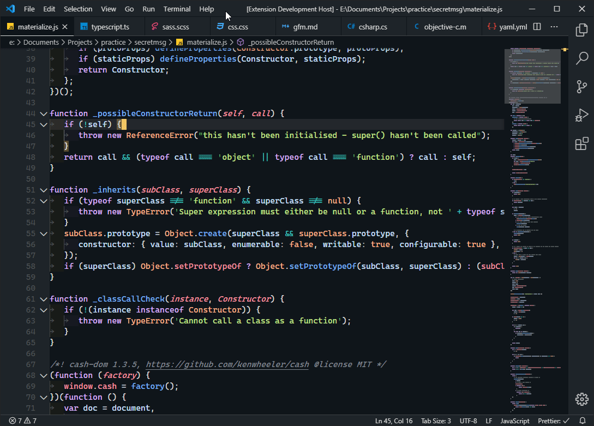

# Mowgli Theme for VSCode

## A Starter theme I created to learn VSCode Theming

### Install @ [VisualStudio Marketplace](https://marketplace.visualstudio.com/items?itemName=wapenshaw.mowgli)

Its based of of my Favourite VSCode theme [Jungle Night](https://github.com/tweakimp/jungle-night).

I added custom coloring to the Syntax. Disabled Semantic Highlighting for now.

I'd also recommend the following extenions which I've used for the screenshot:

1. [Bracket Pair Colorizer 2](https://github.com/CoenraadS/Bracket-Pair-Colorizer-2)
2. [Fira Code Font with Ligature support](https://github.com/tonsky/FiraCode)
3. [Indent Rainbow](https://github.com/oderwat/vscode-indent-rainbow)
4. [Helium Icon Theme](https://github.com/helgardferreira/vscode-helium-icon-theme)

### Demo

